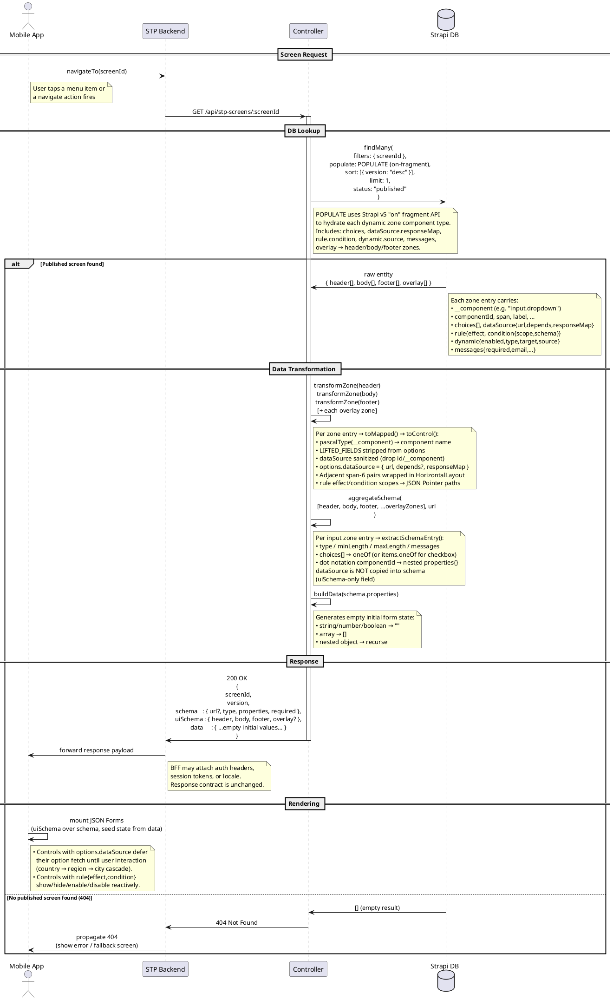

# STP Screen — Initial Load Sequence Diagram

## Actors

| Actor | Role |
|---|---|
| **Mobile App** | Native UI; triggers navigation and renders the final JSON Forms layout |
| **STP Backend** | BFF (Back-for-Frontend) service; the mobile app's single API gateway |
| **Controller** | Strapi `stp-screen` controller — runs `populate → transform → aggregate` |
| **Strapi DB** | Strapi v5 CMS data store (SQLite / MySQL / Postgres) |

## Diagram

## Step-by-step walkthrough

1. **`Mobile App → STP Backend` — `navigateTo(screenId)`**
   The mobile app fires a navigation event with a human-readable `screenId` (e.g. `complete-form-example`). The app itself has no knowledge of Strapi or the JSON payload shape.

2. **`STP Backend → Controller` — `GET /api/stp-screens/:screenId`**
   The BFF proxies the request to Strapi's custom route, which is mapped to the `findByScreenId` handler in `src/api/stp-screen/controllers/stp-screen.ts`.

3. **`Controller → Strapi DB` — `findMany()`**
   The controller queries the `stp-screen` collection using the `screenId` filter, sorted by `version desc`, limited to 1 published document. The `POPULATE` object uses Strapi v5's `on` fragment API to hydrate every component type in the `header`, `body`, and `footer` dynamic zones (including nested `choices`, `dataSource.responseMap`, `rule.condition`, `dynamic.source`).

4. **`Strapi DB → Controller` — raw entity**
   The database returns the latest published version as a raw Strapi entity. Each zone entry is a flat object tagged with `__component` and the component's own attributes.

5. **`Controller` — `transformZone()` (self-call)**
   Defined in `src/api/stp-screen/controllers/transform.ts`. For each zone entry, `toMapped()` strips `LIFTED_FIELDS`, sanitizes the `dataSource` component object (removes Strapi's internal `id` and `__component` keys), and spreads all remaining attributes into `options`. `toControl()` emits the final `{ component, label?, dynamic?, rule?, options }` shape. Adjacent `span: "6"` pairs are automatically wrapped in a `HorizontalLayout`.

6. **`Controller` — `aggregateSchema()` (self-call)**
   Defined in `src/api/stp-screen/controllers/schema-aggregator.ts`. Iterates every input-category zone entry and builds the JSON Schema `properties` map. Static `choices` are lifted as `oneOf` (or `items.oneOf` for checkboxes). Dot-notation `componentId`s (e.g. `personalData.age`) produce nested `object` properties. `dataSource` is intentionally excluded — dynamic option lists live in `uiSchema` only.

7. **`Controller` — `buildData()` (self-call)**
   Defined inline in `stp-screen.ts`. Walks `schema.properties` and produces an initial form state with empty strings, empty arrays, and empty nested objects — ready to seed the JSON Forms state machine.

8. **`Controller → STP Backend` — `200 OK` with shaped entity**
   The `shapeEntity()` function assembles `{ screenId, version, schema, uiSchema, data }` and returns it. The `uiSchema` includes `header`, `body`, `footer`, and an optional `overlay` map keyed by `overlayId`.

9. **`STP Backend → Mobile App` — forward payload**
   The BFF forwards the response as-is (optionally injecting auth/session context). The contract defined in `specs/screen-api-spec.csv` is the boundary both sides rely on.

10. **`Mobile App` — mount JSON Forms (self)**
    The SDUI renderer mounts the `uiSchema` layout over the `schema` type definitions and seeds form state from `data`. Controls that carry `options.dataSource` will fire their option-fetch API calls lazily when the user first interacts with the dropdown (the `depends` field drives cascade resets — covered separately in the dataSource cascade diagram).

> **Out of scope:** runtime `dataSource` option fetching (country → region → city cascade), JSON Forms rule evaluation, form validation, and submit flow.
