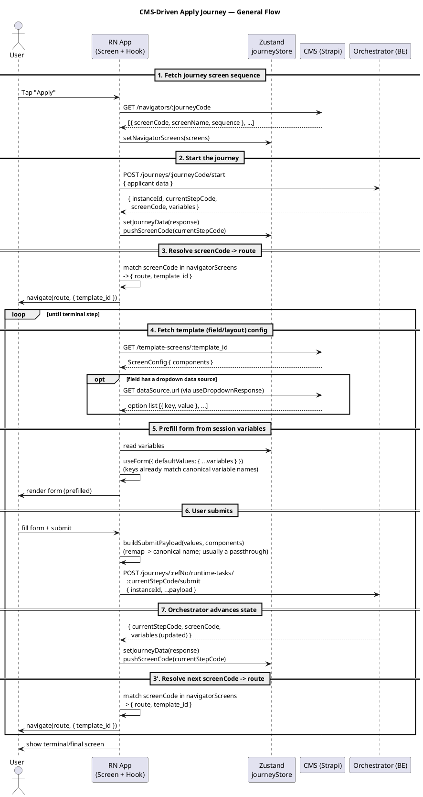

# Frontend Flow — CMS-Driven Apply Journey

End-to-end flow of how the app drives a CMS/orchestrator-defined journey (e.g. the Credit Card Apply flow), from fetching the screen sequence out of the CMS to submitting the final step. This is the general shape shared by every journey step — it does not enumerate individual screens.

---

## Actors

| Actor | Responsibility |
| --- | --- |
| **RN App** | Screens (presentational) + hooks (all logic), Zustand `journeyStore` |
| **CMS (Strapi)** | Source of truth for the journey's screen sequence (`Navigator`) and per-screen field/layout config (`Template Screen`) |
| **Orchestrator (BE)** | Owns journey state machine: current step, session `variables`, validates + advances on submit |

Key files:
- [`journeyApi.ts`](../src/features/apply/api/journeyApi.ts) — navigator fetch, start/submit journey, screen-code → route resolution
- [`cmsService.ts`](../src/engine/cmsService.ts) — template screen (field/layout config) fetch
- [`resolveBindings.ts`](../src/engine/resolveBindings.ts) — submit payload key remapping (legacy binding-resolution helpers, mostly superseded — see step 5)
- [`templateScreenApi.ts`](../src/features/apply/api/templateScreenApi.ts) — component type guards, incl. `isDropdownComponent`
- [`useDropdownResponse.ts`](../src/features/apply/hooks/useDropdownResponse.ts) — fetches live option lists for dropdown-backed select fields
- [`journeyStore.ts`](../src/store/journeyStore.ts) — `variables`, `navigatorScreens`, `screenCodeStack`, `submittedData`

---

## Flow

1. **Fetch the Navigator (screen sequence) from the CMS.**
   Before starting a journey, the app calls `GET /api/navigators/:journeyCode` to get the ordered list of `{ screenCode, screenName, sequence }` the journey can visit. This is stored in `journeyStore.navigatorScreens` — it's the map used later to translate a backend `screenCode` into an actual RN route.

2. **Start the journey with the orchestrator.**
   The app POSTs initial applicant data to `/orchestrator/journeys/:journeyCode/start`. The orchestrator creates a journey instance and responds with the **first step**: `instanceId`, `currentStepCode`, `screenCode`, and a `variables` bag (session data collected so far, e.g. mobile number, product name).

3. **Match the returned `screenCode` against the Navigator to resolve a route.**
   The app looks up the response's `screenCode` in the stored `navigatorScreens`, maps it to a concrete RN screen + `template_id` via a static screen→route table, and navigates there. `journeyStore.screenCodeStack` is pushed so client-side back-navigation still knows which orchestrator step to resubmit to.

4. **The destination screen fetches its Template Screen config from the CMS.**
   Each journey-step screen calls its hook, which fetches `GET /api/template-screens/:template_id` — a CMS-authored `ScreenConfig` describing every field/component on the screen (labels, types, options, validation messages).

   *If a field's component is a dropdown backed by a live data source (`isDropdownComponent`, e.g. relationship or payment-option pickers), the hook makes a second, independent request via `useDropdownResponse(dataSource.url, template_id)` to fetch that field's option list — separate from the Template Screen config fetch above.*

5. **Prefill form defaults directly from session `variables`.**
   The orchestrator's `variables` bag is keyed by the same canonical, UPPER_SNAKE_CASE names the form's Zod schema and react-hook-form fields use (e.g. `EMERGENCY_MOBILE_NUMBER`, `ADDRESS_TYPE`). Because the names already match, prefill is a direct spread — `useForm({ defaultValues: { ...variables } })` — with no separate binding-resolution/lookup step. This is what lets a user navigate back to a previously-completed step and see their prior answers.

6. **User fills the form and submits.**
   The hook posts to `/orchestrator/journeys/:refNo/runtime-tasks/:currentStepCode/submit` with a flat body `{ instanceId, ...formValues }` — no wrapper object. The values still pass through a key-remap step (`buildSubmitPayload`) that looks up each CMS component's `defaultValue` to translate a field's key to the backend's canonical name; since field keys are now usually already the canonical name, this is typically a passthrough, but it remains the mechanism for any field that still needs remapping.

7. **Orchestrator validates, advances state, and returns the next step.**
   The response has the same shape as `start`: an updated `variables` bag (now including whatever was just submitted) and a new `screenCode` for the next step.

8. **Repeat steps 3–7** — match `screenCode` → route, fetch that screen's template config, prefill from variables, submit — until the orchestrator returns a terminal step (e.g. the final confirmation/success screen), at which point the loop ends.

Two things stay constant across every iteration: the **Navigator** (fetched once, used every step purely for `screenCode` → route lookup) and the **`variables` bag** (grows/updates every submit, is the single source of truth for prefilling any step the user revisits).

---

## Sequence Diagram (PlantUML)

> Render with any PlantUML viewer (e.g. the PlantUML VS Code extension, or `plantuml.com/plantuml`) by pasting the block above.
